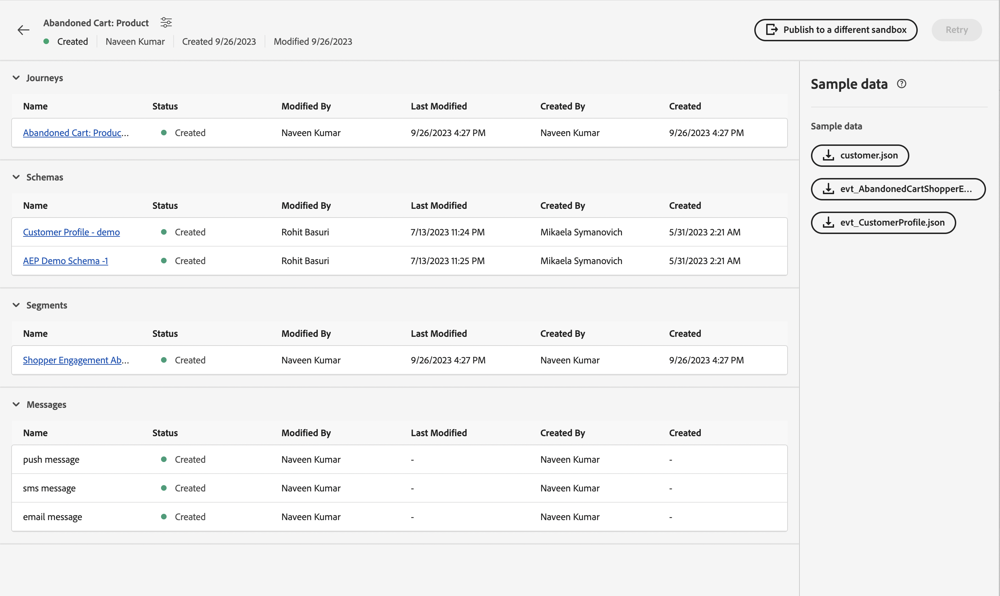

# Eenmalige gebeurtenis

## Te volgen stappen {#steps-to-follow}

>[!CONTEXTUALHELP]
>id="marketerexp_sampledata_unitaryevent"
>title="Hoe wordt het gebruikt?"
>abstract="Klik op de koppeling voor meer informatie"

>[!IMPORTANT]
>
>Deze instructies kunnen **[!UICONTROL Playbook]** Raadpleeg dus altijd het gedeelte Voorbeeldgegevens van de betreffende **[!UICONTROL Playbook]**.

## Vereiste

* Afspeelboek gebruiken om instanties te maken zoals **[!UICONTROL Journey]**, **[!UICONTROL Schemas]**, **[!UICONTROL Segments]**, **[!UICONTROL Messages]** enz.

* Gemaakte elementen worden weergegeven op `Bill Of Material` Pagina

<!-- TODO: attached image needs to change once postman is removed from UI -->


>[!TIP]
>
>Als u een terminal gebruikt om de curls uit te voeren, kunt u variabelewaarden instellen voordat u de curls uitvoert, zodat het niet nodig is deze waarden in afzonderlijke curls te vervangen.
>Bijvoorbeeld: als u instelt `ORG_ID=**&#x200B;**&#x200B;**&#x200B;**&#x200B;**&#x200B;**@AdobeOrg`, vervangt shell automatisch elk voorkomen van `$ORG_ID` met de waarde, zodat u de curls hieronder kunt kopiëren, plakken en uitvoeren zonder wijzigingen aan te brengen.
>
> In dit document worden de volgende variabelen gebruikt
>
> ACCESS_TOKEN
>
> API_KEY
>
> ORG_ID
>
> SANDBOX_NAME
>
> PROFILE_SCHEMA_REF
>
> PROFILE_DATASET_NAME
>
> PROFILE_DATASET_ID
>
> JOURNEY_ID
>
> PROFILE_BASE_CONNECTION_ID
>
> PROFILE_SOURCE_CONNECTION_ID
>
> PROFILE_TARGET_CONNECTION_ID
>
> PROFILE_INLET_URL
>
> CUSTOMER_MOBILE_NUMBER
>
> CUSTOMER_FIRST_NAME
>
> CUSTOMER_LAST_NAME
>
> EMAIL
>
> EVENT_SCHEMA_REF
>
> EVENT_DATASET_NAME
>
> EVENT_DATASET_ID
>
> EVENT_BASE_CONNECTION_ID
>
> EVENT_SOURCE_CONNECTION_ID
>
> EVENT_TARGET_CONNECTION_ID
>
> EVENT_INLET_URL
>
> TIJDSTEMPEL
>
> UNIQUE_EVENT_ID

## IMS-token ophalen

1. Volg deze [API&#39;s van Experience Platforms verifiëren en openen](https://experienceleague.adobe.com/docs/experience-platform/landing/platform-apis/api-authentication.html?lang=nl-NL) documentatie om de Token van de Toegang te produceren.

## De reis publiceren die is gemaakt door Playbook

Er zijn twee manieren om de reis te publiceren; u kunt om het even welke van hen kiezen:

1. **De interface van AJO gebruiken** - klik op de koppeling Reis op `Bill Of Material Page`; dit leidt u naar de pagina Journey waarop u kunt klikken **[!UICONTROL Publish]** en Journey worden gepubliceerd.

   

1. **cURL gebruiken**

   1. Publiceer de reis. De reactie zal baanidentiteitskaart nodig in volgende stap bevatten om reis publicatiestatus te halen.

      ```bash
      curl --location --request POST "https://journey-private.adobe.io/authoring/jobs/journeyVersions/$JOURNEY_ID/deploy" \
      --header "Accept: */*" \
      --header "Authorization: Bearer $ACCESS_TOKEN" \
      --header "x-api-key: $API_KEY" \
      --header "x-gw-ims-org-id: $ORG_ID" \
      --header "x-sandbox-name: $SANDBOX_NAME" \
      --header "Content-Type: application/json" 
      ```

   1. Het kan enige tijd duren voordat een reis wordt gepubliceerd. Als u de status wilt controleren, voert u deze uit onder cURL tot aan het `response.status` is `SUCCESS`, zorg ervoor om 10 tot 15 seconden te wachten als de reis publiceert tijd vergt.

      ```bash
      curl --location "https://journey-private.adobe.io/authoring/jobs/$JOB_ID" \
      --header "Authorization: Bearer $ACCESS_TOKEN" \
      --header "x-api-key: $API_KEY" \
      --header "x-gw-ims-org-id: $ORG_ID" \
      --header "x-sandbox-name: $SANDBOX_NAME" \
      --header "Content-Type: application/json"
      ```

## Maak kennis met het profiel van de klant

>[!TIP]
>
>Als uw e-mailprovider ondersteuning biedt voor plus e-mailberichten, kunt u hetzelfde e-mailadres opnieuw gebruiken door het toevoegen van `+<variable>` in uw e-mail, bijvoorbeeld `usertest@email.com` kan worden gebruikt zoals `usertest+v1@email.com` of `usertest+24jul@email.com`. Dit is handig als u telkens een nieuw profiel wilt gebruiken, maar toch dezelfde e-mailadres gebruikt.
>
>P.S.: Plus-e-mails zijn een configureerbare functie die door de e-mailprovider moet worden ondersteund. Controleer of je e-mails over deze adressen kunt ontvangen voordat je ze tijdens de test gebruikt.

1. De eerste gebruiker moet de **[!DNL customer dataset]** en **[!DNL HTTP Streaming Inlet Connection]**.
1. Als u al **[!DNL customer dataset]** en **[!DNL HTTP Streaming Inlet Connection]**, ga verder met de stap `5`.
1. Maak een gegevensset met klantprofielen door de onderstaande cURL uit te voeren.

   ```bash
   curl --location "https://platform.adobe.io/data/foundation/catalog/dataSet" \
   --header "Authorization: Bearer $ACCESS_TOKEN" \
   --header "x-gw-ims-org-id: $ORG_ID" \
   --header "x-sandbox-name: $SANDBOX_NAME" \
   --header "x-api-key: $API_KEY" \
   --header "Content-Type: application/json" \
   --data '{
       "name": "'$PROFILE_DATASET_NAME'",
       "schemaRef": {
           "id": "'$PROFILE_SCHEMA_REF'",
           "contentType": "application/vnd.adobe.xed-full-notext+json; version=1"
       },
       "tags": {
           "unifiedProfile": [
           "enabled:true"
           ],
           "unifiedIdentity": [
           "enabled:true"
           ]
       },
       "fileDescription": {
           "persisted": true,
           "containerFormat": "parquet",
           "format": "parquet"
       }
   }'
   ```

   De reactie zal van formaat zijn `"@/dataSets/<PROFILE_DATASET_ID>"`.

1. Maken **[!DNL HTTP Streaming Inlet Connection]** met behulp van de volgende stappen.
   1. Maak een basisverbinding.

      ```bash
      curl --location "https://platform.adobe.io/data/foundation/flowservice/connections?Cache-Control=no-cache" \
      --header "Authorization: Bearer $ACCESS_TOKEN" \
      --header "x-gw-ims-org-id: $ORG_ID" \
      --header "x-sandbox-name: $SANDBOX_NAME" \
      --header "x-api-key: $API_KEY" \
      --header "Content-Type: application/json" \
      --data '{
          "name": "AbandonedCartProduct_Base_ConnectionForCustomerProfile_1694458293",
          "description": "Marketer Playground Playbook-Validation Customer Profile Base Connection 1",
          "auth": {
              "specName": "Streaming Connection",
              "params": {
                  "dataType": "xdm"
              }
          },
          "connectionSpec": {
              "id": "bc7b00d6-623a-4dfc-9fdb-f1240aeadaeb",
              "version": "1.0"
          }
      }'
      ```

      Haal de id van de basisverbinding van de reactie op en gebruik deze in plaats van `PROFILE_BASE_CONNECTION_ID` in volgende cURL&#39;s

   1. Bronverbinding maken.

      ```bash
      curl --location "https://platform.adobe.io/data/foundation/flowservice/sourceConnections" \
      --header "Authorization: Bearer $ACCESS_TOKEN" \
      --header "x-gw-ims-org-id: $ORG_ID" \
      --header "x-sandbox-name: $SANDBOX_NAME" \
      --header "Content-Type: application/json" \
      --header "x-api-key: $API_KEY" \
      --data '{
          "name": "AbandonedCartProduct_Source_ConnectionForCustomerProfile_1694458318",
          "description": "Marketer Playground Playbook-Validation Customer Profile Source Connection 1",
          "baseConnectionId": "'$PROFILE_BASE_CONNECTION_ID'",
          "connectionSpec": {
              "id": "bc7b00d6-623a-4dfc-9fdb-f1240aeadaeb",
              "version": "1.0"
          }
      }'
      ```

      Haal de id van de bronverbinding op uit de reactie en gebruik deze in plaats van `PROFILE_SOURCE_CONNECTION_ID`

   1. Doelverbinding maken.

      ```bash
      curl --location "https://platform.adobe.io/data/foundation/flowservice/targetConnections" \
      --header "Authorization: Bearer $ACCESS_TOKEN" \
      --header "x-gw-ims-org-id: $ORG_ID" \
      --header "x-sandbox-name: $SANDBOX_NAME" \
      --header "Content-Type: application/json" \
      --header "x-api-key: $API_KEY" \
      --data '{
          "name": "AbandonedCartProduct_Target_ConnectionForCustomerProfile_1694458407",
          "description": "Marketer Playground Playbook-Validation Customer Profile Target Connection 1",
          "data": {
              "format": "parquet_xdm",
              "schema": {
                  "version": "application/vnd.adobe.xed-full+json;version=1",
                  "id": "'$PROFILE_SCHEMA_REF'"
              },
              "properties": null
          },
          "connectionSpec": {
              "id": "c604ff05-7f1a-43c0-8e18-33bf874cb11c",
              "version": "1.0"
          },
          "params": {
              "dataSetId": "'$PROFILE_DATASET_ID'"
          }
      }'
      ```

      Haal id van doelverbinding uit de reactie op en gebruik deze in plaats van `PROFILE_TARGET_CONNECTION_ID`

   1. Maak een gegevensstroom.

      ```bash
      curl --location "https://platform.adobe.io/data/foundation/flowservice/flows" \
      --header "Authorization: Bearer $ACCESS_TOKEN" \
      --header "x-gw-ims-org-id: $ORG_ID" \
      --header "x-sandbox-name: $SANDBOX_NAME" \
      --header "Content-Type: application/json" \
      --header "x-api-key: $API_KEY" \
      --data '{
          "name": "AbandonedCartProduct_Dataflow_ForCustomerCustomerProfile_1694460528",
          "description": "Marketer Playground Playbook-Validation Customer Profile Dataflow 1",
          "flowSpec": {
              "id": "d8a6f005-7eaf-4153-983e-e8574508b877",
              "version": "1.0"
          },
          "sourceConnectionIds": [
              "'$PROFILE_SOURCE_CONNECTION_ID'"
          ],
          "targetConnectionIds": [
              "'$PROFILE_TARGET_CONNECTION_ID'"
          ]
      }'
      ```

   1. Basisverbinding ophalen. Het resultaat bevat inletUrl die vereist is om profielgegevens te verzenden.

      ```bash
      curl --location "https://platform.adobe.io/data/foundation/flowservice/connections/$PROFILE_BASE_CONNECTION_ID" \
      --header "Authorization: Bearer $ACCESS_TOKEN" \
      --header "x-gw-ims-org-id: $ORG_ID" \
      --header "x-sandbox-name: $SANDBOX_NAME" \
      --header "Content-Type: application/json" \
      --header "x-api-key: $API_KEY"
      ```

      Haal inletUrl uit de reactie op en gebruik deze in plaats van `PROFILE_INLET_URL`

1. In deze stap moet de gebruiker waarden hebben van `PROFILE_DATASET_ID` en `PROFILE_INLET_URL`; zo niet, raadpleeg stap `3` of `4` respectievelijk.
1. Om klant in te voeren, moet de gebruiker vervangen `CUSTOMER_MOBILE_NUMBER`, `CUSTOMER_FIRST_NAME`, `CUSTOMER_LAST_NAME` en `EMAIL` in onder cURL&#39;s.

   1. `CUSTOMER_MOBILE_NUMBER` zou een mobiel nummer zijn, bijvoorbeeld `+1 000-000-0000`
   1. `CUSTOMER_FIRST_NAME` zou de voornaam van de gebruiker zijn
   1. `CUSTOMER_LAST_NAME` zou de achternaam van de gebruiker zijn
   1. `EMAIL` Het e-mailadres van de gebruiker zou zijn, dit is essentieel om verschillende e-mailadressen te gebruiken zodat een nieuw profiel kan worden opgenomen.

1. Tot slot voer de krulling uit om klantenprofiel op te nemen. Bijwerken `body.xdmEntity.consents.marketing.preferred` tot `email`, `sms`, of `push` op basis van de kanalen die u wilt controleren. Ook corresponderende instellen `val` tot `y`.

   ```bash
   curl --location "$PROFILE_INLET_URL?synchronousValidation=true" \
   --header 'Content-Type: application/json' \
   --data-raw '{
       "header": {
           "schemaRef": {
               "id": "'$PROFILE_SCHEMA_REF'",
               "contentType": "application/vnd.adobe.xed-full+json;version=1.0"
           },
           "imsOrgId": "'$ORG_ID'",
           "datasetId": "'$PROFILE_DATASET_ID'",
           "source": {
               "name": "Streaming dataflow - 1694460605"
           }
       },
       "body": {
           "xdmMeta": {
               "schemaRef": {
                   "id": "'$PROFILE_SCHEMA_REF'",
                   "contentType": "application/vnd.adobe.xed-full+json;version=1.0"
               }
           },
           "xdmEntity": {
           "consents": {
               "marketing": {
                   "preferred": "email",
                   "email": {
                       "val": "y"
                   },
                   "push": {
                       "val": "n"
                   },
                   "sms": {
                       "val": "n"
                   }
               }
           },
           "mobilePhone": {
               "number": "'$CUSTOMER_MOBILE_NUMBER'",
               "status": "active"
           },
           "person": {
               "name": {
               "firstName": "'$CUSTOMER_FIRST_NAME'",
               "lastName": "'$CUSTOMER_LAST_NAME'"
               }
           },
           "personalEmail": {
               "address": "'$EMAIL'"
           },
           "testProfile": false
           }
       }
   }'
   ```

## Ingest-gebeurtenis voor reizen

1. De eerste keer dat de gebruiker de **[!DNL event dataset]** en **[!DNL HTTP Streaming Inlet Connection for events]**
1. Als u al **[!DNL event dataset]** en **[!DNL HTTP Streaming Inlet Connection for events]**, ga verder met de stap `5`.
1. Maak een gebeurtenisgegevensset door de onderstaande cURL uit te voeren.

   ```bash
   curl --location "https://platform.adobe.io/data/foundation/catalog/dataSet" \
   --header "Authorization: Bearer $ACCESS_TOKEN" \
   --header "x-gw-ims-org-id: $ORG_ID" \
   --header "x-sandbox-name: $SANDBOX_NAME" \
   --header "x-api-key: $API_KEY" \
   --header "Content-Type: application/json" \
   --data '{
       "name": "'$EVENT_DATASET_NAME'",
       "schemaRef": {
           "id": "'$EVENT_SCHEMA_REF'",
           "contentType": "application/vnd.adobe.xed-full-notext+json; version=1"
       },
       "tags": {
           "unifiedProfile": [
               "enabled:true"
           ],
           "unifiedIdentity": [
               "enabled:true"
           ]
       },
       "fileDescription": {
           "persisted": true,
           "containerFormat": "parquet",
           "format": "parquet"
       }
   }'
   ```

   De reactie zal van formaat zijn `"@/dataSets/<EVENT_DATASET_ID>"`

1. Maken **[!DNL HTTP Streaming Inlet Connection for events]**  met behulp van de volgende stappen.
   <!-- TODO: Is the name unique? If so, we may need to generate and provide in variables.txt-->
   1. Maak een basisverbinding.

      ```bash
      curl --location "https://platform.adobe.io/data/foundation/flowservice/connections?Cache-Control=no-cache" \
      --header "Authorization: Bearer $ACCESS_TOKEN" \
      --header "x-gw-ims-org-id: $ORG_ID" \
      --header "x-sandbox-name: $SANDBOX_NAME" \
      --header "x-api-key: $API_KEY" \
      --header "Content-Type: application/json" \
      --data '{
          "name": "AbandonedCartProduct_Base_ConnectionForAEPDemoSchema_1694461448",
          "description": "Marketer Playground Playbook-Validation AEP Demo Schema Base Connection 1",
          "auth": {
              "specName": "Streaming Connection",
              "params": {
                  "dataType": "xdm"
              }
          },
          "connectionSpec": {
              "id": "bc7b00d6-623a-4dfc-9fdb-f1240aeadaeb",
              "version": "1.0"
          }
      }'
      ```

      Haal de id van de basisverbinding van de reactie op en gebruik deze in plaats van `EVENT_BASE_CONNECTION_ID`

   1. Bronverbinding maken.

      ```bash
      curl --location "https://platform.adobe.io/data/foundation/flowservice/sourceConnections" \
      --header "Authorization: Bearer $ACCESS_TOKEN" \
      --header "x-gw-ims-org-id: $ORG_ID" \
      --header "x-sandbox-name: $SANDBOX_NAME" \
      --header "x-api-key: $API_KEY" \
      --header "Content-Type: application/json" \
      --data '{
          "name": "AbandonedCartProduct_Source_ConnectionForAEPDemoSchema_1694461464",
          "description": "Marketer Playground Playbook-Validation AEP Demo Schema Source Connection 1",
          "baseConnectionId": "'$EVENT_BASE_CONNECTION_ID'",
          "connectionSpec": {
              "id": "bc7b00d6-623a-4dfc-9fdb-f1240aeadaeb",
              "version": "1.0"
          }
      }'
      ```

      Haal de id van de bronverbinding op uit de reactie en gebruik deze in plaats van `EVENT_SOURCE_CONNECTION_ID`

   1. Doelverbinding maken.

      ```bash
      curl --location "https://platform.adobe.io/data/foundation/flowservice/sourceConnections" \
      --header "Authorization: Bearer $ACCESS_TOKEN" \
      --header "x-gw-ims-org-id: $ORG_ID" \
      --header "x-sandbox-name: $SANDBOX_NAME" \
      --header "x-api-key: $API_KEY" \
      --header "Content-Type: application/json" \
      --data '{
          "name": "AbandonedCartProduct_Target_ConnectionForAEPDemoSchema_1694802667",
          "description": "Marketer Playground Playbook-Validation AEP Demo Schema Target Connection 1",
          "data": {
              "format": "parquet_xdm",
              "schema": {
                  "version": "application/vnd.adobe.xed-full+json;version=1",
                  "id": "'$EVENT_SCHEMA_REF'"
              },
              "properties": null
          },
          "connectionSpec": {
              "id": "c604ff05-7f1a-43c0-8e18-33bf874cb11c",
              "version": "1.0"
          },
          "params": {
              "dataSetId": "'$EVENT_DATASET_ID'"
          }
      }'
      ```

      Haal id van doelverbinding uit de reactie op en gebruik deze in plaats van `EVENT_TARGET_CONNECTION_ID`

   1. Maak een gegevensstroom.

      ```bash
      curl --location "https://platform.adobe.io/data/foundation/flowservice/flows" \
      --header "Authorization: Bearer $ACCESS_TOKEN" \
      --header "x-gw-ims-org-id: $ORG_ID" \
      --header "x-sandbox-name: $SANDBOX_NAME" \
      --header "x-api-key: $API_KEY" \
      --header "Content-Type: application/json" \
      --data '{
          "name": "AbandonedCartProduct_Dataflow_ForCustomerAEPDemoSchema_1694461564",
          "description": "Marketer Playground Playbook-Validation AEP Demo Schema Dataflow 1",
          "flowSpec": {
              "id": "d8a6f005-7eaf-4153-983e-e8574508b877",
              "version": "1.0"
          },
          "sourceConnectionIds": [
              "'$EVENT_SOURCE_CONNECTION_ID'"
          ],
          "targetConnectionIds": [
              "'$EVENT_TARGET_CONNECTION_ID'"
          ]
      }'
      ```

   1. Basisverbinding ophalen. Het resultaat bevat inletUrl die vereist is om profielgegevens te verzenden.

   ```bash
   curl --location "https://platform.adobe.io/data/foundation/flowservice/connections/$EVENT_BASE_CONNECTION_ID" \
       --header "Authorization: Bearer $ACCESS_TOKEN" \
       --header "x-gw-ims-org-id: $ORG_ID" \
       --header "x-sandbox-name: $SANDBOX_NAME" \
       --header "x-api-key: $API_KEY" \
       --header "Content-Type: application/json" 
   ```

   Haal inletUrl uit de reactie op en gebruik deze in plaats van `EVENT_INLET_URL`

1. In deze stap moet de gebruiker waarden hebben van `EVENT_DATASET_ID` en `EVENT_INLET_URL`; zo niet, raadpleeg stap `3` of `4` respectievelijk.
1. Om gebeurtenis in te voeren, moet de gebruiker de tijdvariabele veranderen `TIMESTAMP` in request body van cURL verderop.

   1. Vervangen `body.xdmEntity` met inhoud van gedownloade gebeurtenis json.
   1. `TIMESTAMP` gebruikt u het tijdstempel in UTC-tijdzone, bijvoorbeeld `2023-09-05T23:57:00.071+00:00`.
   1. Een unieke waarde voor de variabele instellen `UNIQUE_EVENT_ID`.

   ```bash
   curl --location "$EVENT_INLET_URL?synchronousValidation=true" \
   --header 'Content-Type: application/json' \
   --data-raw '{
       "header": {
           "schemaRef": {
               "id": "'$EVENT_SCHEMA_REF'",
               "contentType": "application/vnd.adobe.xed-full+json;version=1.0"
           },
           "imsOrgId": "'$ORG_ID'",
           "datasetId": "'$EVENT_DATASET_ID'",
           "source": {
               "name": "Streaming dataflow - 8/31/2023 9:04:25 PM"
           }
       },
       "body": {
           "xdmMeta": {
               "schemaRef": {
                   "id": "'$EVENT_SCHEMA_REF'",
                   "contentType": "application/vnd.adobe.xed-full+json;version=1.0"
               }
           },
           "xdmEntity": {
               "endUserIDs": {
                   "_experience": {
                       "aaid": {
                           "id": "'$EMAIL'"
                       },
                       "emailid": {
                           "id": "'$EMAIL'"
                       }
                   }
               },
               "_experience": {
                   "analytics": {
                       "customDimensions": {
                           "eVars": {
                           "eVar235": "AC11147"
                           }
                       }
                   }
               },
               "_id": "'$UNIQUE_EVENT_ID'",
               "commerce": {
                   "productListAdds": {
                       "value": 11498
                   }
               },
               "eventType": "commerce.productListAdds",
               "productListItems": [
                   {
                       "_id": "ACS1620",
                       "SKU": "P1",
                       "_experience": {
                           "analytics": {
                           "customDimensions": {
                               "eVars": {
                                   "eVar1": "Pants"
                               }
                           }
                           }
                       },
                       "currencyCode": "USD",
                       "name": "Sample value",
                       "priceTotal": 30841.13,
                       "product": "https://ns.adobe.com/xdm/common/uri",
                       "productAddMethod": "Sample value",
                       "quantity": 1
                   },
                   {
                       "_id": "ACS1729",
                       "SKU": "P2",
                       "_experience": {
                           "analytics": {
                               "customDimensions": {
                                   "eVars": {
                                       "eVar1": "Galliano"
                                   }
                               }
                           }
                       },
                       "currencyCode": "USD",
                       "name": "Sample value",
                       "priceTotal": 20841.13,
                       "product": "https://ns.adobe.com/xdm/common/uri",
                       "productAddMethod": "Sample value",
                       "quantity": 2
                   }
               ],
               "timestamp": "'$TIMESTAMP'",
               "web": {
                   "webInteraction": {
                       "URL": "https://experienceleague.adobe.com/docs/experience-platform/edge/data-collection/collect-commerce-data.html?lang=nl-NL",
                       "name": "Sample value",
                       "region": "Sample value"
                   },
                   "webPageDetails": {
                       "URL": "https://experienceleague.adobe.com/docs/experience-platform/edge/data-collection/collect-commerce-data.html?lang=nl-NL",
                       "isErrorPage": false,
                       "isHomePage": false,
                       "name": "Sample value",
                       "pageViews": {
                           "id": "Sample value",
                           "value": 1
                       },
                       "server": "Sample value",
                       "siteSection": "Sample value",
                       "viewName": "Sample value"
                   },
                   "webReferrer": {
                   "URL": "Sample value",
                   "type": "internal"
                   }
               }
           }
       }
   }'
   ```

## Laatste validatie

U moet een bericht ontvangen over het geselecteerde voorkeurkanaal dat in **[!DNL Ingest the Customer Profile]** stap `8`

* `SMS` indien voorkeurkanaal `sms` op `customer_country_code` en `customer_mobile_no`
* `Email` indien voorkeurkanaal `email` op `email`

U kunt ook controleren `Journey Report`klikt u op `Journey Object` op `Bill of Materials page` dit leidt u naar `Journey Details page`.

Voor elke gepubliceerde Reis-gebruiker moet een **[!UICONTROL View report]** knop


## Opruimen

Gelieve te hebben niet de veelvoudige instanties van `Journey` Als u tegelijkertijd werkt, moet u de Reis stoppen als deze alleen geldig is nadat de validatie is voltooid.
